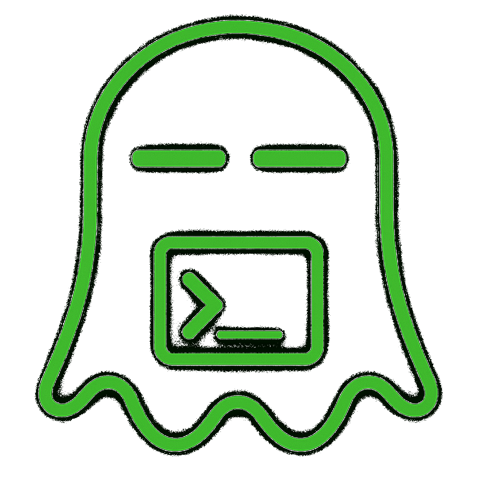

<div align="center">



# 🤖 darbot-coder

> **AI-powered autonomous coding agent orchestration platform** that lives in your editor. Building on Darbot's foundation, darbot-coder can orchestrate multiple AI agents for complex workflows while optimizing costs through intelligent model routing.

<a href="https://marketplace.visualstudio.com/items?itemName=DarbotFramework.darbot-coder" target="_blank"></a>
<a href="https://github.com/DarbotFramework/darbot-coder/discussions/categories/feature-requests" target="_blank"></a>
<a href="https://marketplace.visualstudio.com/items?itemName=DarbotFramework.darbot-coder&ssr=false#review-details" target="_blank"></a>
<a href="https://docs.darbot.ai" target="_blank"></a>

</div>

**darbot-coder** is an AI-powered **autonomous coding agent** that lives in your editor. This orchestration platform can:

- **Communicate in natural language**
- **Read and write files** directly in your workspace
- **Run terminal commands**
- **Automate browser actions**
- **Integrate with any OpenAI-compatible or custom API/model**
- **Adapt its "personality" and capabilities** through **Custom Modes**
- **Orchestrate multiple AI agents** for complex workflows
- **Optimize costs** through intelligent model routing

Whether you're seeking a flexible coding partner, a system architect, or specialized roles like a QA engineer or product manager, darbot-coder can help you build software more efficiently through intelligent agent coordination.

Check out the [CHANGELOG](CHANGELOG.md) for detailed updates and fixes.

---

## 🎉 darbot-coder 1.0 - The AI Orchestration Revolution

darbot-coder 1.0 represents a groundbreaking evolution in AI-assisted development, introducing the world's first **AI agent orchestration platform** for software development!

- **Multi-Agent Coordination** - Deploy multiple specialized AI agents working together on complex tasks
- **Intelligent Orchestration** - Automatic task analysis and optimal agent selection
- **Cost Optimization** - Smart model routing reduces API costs by 40-60%
- **Darbotian Philosophy** - Ethical AI development with measurable outcomes

---

## What Can darbot-coder Do?

- 🚀 **Generate Code** from natural language descriptions
- 🔧 **Refactor & Debug** existing code
- 📝 **Write & Update** documentation
- 🤔 **Answer Questions** about your codebase
- 🔄 **Automate** repetitive tasks
- 🏗️ **Create** new files and projects
- 🎭 **Orchestrate** multiple AI agents for complex workflows
- 💰 **Optimize** costs through intelligent routing

## Quick Start

1. [Install darbot-coder](https://docs.darbot.ai/getting-started/installing)
2. [Connect Your AI Provider](https://docs.darbot.ai/getting-started/connecting-api-provider)
3. [Try Your First Task](https://docs.darbot.ai/getting-started/your-first-task)

## Key Features

### Multiple Modes

darbot-coder adapts to your needs with specialized [modes](https://docs.darbot.ai/basic-usage/using-modes):

- **Code Mode:** For general-purpose coding tasks
- **Architect Mode:** For planning and technical leadership
- **Ask Mode:** For answering questions and providing information
- **Debug Mode:** For systematic problem diagnosis
- **[Custom Modes](https://docs.darbot.ai/advanced-usage/custom-modes):** Create unlimited specialized personas for security auditing, performance optimization, documentation, or any other task

### Smart Tools

darbot-coder comes with powerful [tools](https://docs.darbot.ai/basic-usage/how-tools-work) that can:

- Read and write files in your project
- Execute commands in your VS Code terminal
- Control a web browser
- Use external tools via [MCP (Model Context Protocol)](https://docs.darbot.ai/advanced-usage/mcp)

MCP extends darbot-coder's capabilities by allowing you to add unlimited custom tools. Integrate with external APIs, connect to databases, or create specialized development tools - MCP provides the framework to expand darbot-coder's functionality to meet your specific needs.

### Customization

Make darbot-coder work your way with:

- [Custom Instructions](https://docs.darbot.ai/advanced-usage/custom-instructions) for personalized behavior
- [Custom Modes](https://docs.darbot.ai/advanced-usage/custom-modes) for specialized tasks
- [Local Models](https://docs.darbot.ai/advanced-usage/local-models) for offline use
- [Auto-Approval Settings](https://docs.darbot.ai/advanced-usage/auto-approving-actions) for faster workflows

## Resources

### Documentation

- [Basic Usage Guide](https://docs.darbot.ai/basic-usage/the-chat-interface)
- [Advanced Features](https://docs.darbot.ai/advanced-usage/auto-approving-actions)
- [Frequently Asked Questions](https://docs.darbot.ai/faq)

### Community

- **Discord:** [Join our Discord server](https://discord.gg/darbot-coder) for real-time help and discussions
- **GitHub:** Report [issues](https://github.com/DarbotFramework/darbot-coder/issues) or request [features](https://github.com/DarbotFramework/darbot-coder/discussions/categories/feature-requests)

---

## 🙏 **Attribution & Inspiration**

**darbot-coder is a derivative work based on open-source AI coding tools**, building upon excellent foundations in AI-assisted coding. We are deeply grateful to the open-source community for their foundational work that made this orchestration platform possible.

**darbot-coder** creates an AI agent orchestration platform that embodies the **darbotian philosophy**: *"Proficiency and determination through ethical results driven outcomes."*

---

## Environment Configuration

darbot-coder relies on a root `.env` file to describe every AI provider and integration that the orchestration layer can access. The committed template groups credentials for Azure OpenAI (Sora, GPT-Image-1, chat deployments), Flux/Foundry routing, Microsoft Dataverse, and optional GitHub automation.

**Set up your secrets**

1. Copy the template to a private file (`cp .env .env.local` on macOS/Linux or `Copy-Item .env .env.local` in PowerShell).
2. Replace placeholder values such as `your-resource-name` or `your-api-key` with credentials from your own subscriptions.
3. Remove entries for services you are not using—the extension skips providers without keys.
4. Keep the populated file out of version control; `.gitignore` already covers `.env*`.

**Variable groups at a glance**

- `SORA_*` / `SORA_AOAI_*`: Azure OpenAI Sora video generation.
- `IMAGEGEN_*`: Azure OpenAI GPT-Image-1 image generation.
- `FOUNDRY_*`, `FLUX_*`, `GROK_*`, `GPT_4_1_*`, `GPT_5_*`, `MODEL_ROUTER_*`, `O4_*`: Model router and Foundry-hosted multimodal deployments.
- `DATAVERSE_*`: Microsoft Dataverse connectivity for asset storage.
- `GITHUB_*`: Optional GitHub integration for workflow automation.
- `MODEL_PROVIDER`, `AOAI_API_VERSION`, and related IDs: Global defaults that keep orchestration aligned with the active provider.
- `NEXT_PUBLIC_POSTHOG_KEY`, `NEXT_PUBLIC_POSTHOG_HOST`: Optional analytics key/host for the marketing site (`apps/web-darbot-coder`). When unset, the site skips loading PostHog entirely and renders without warnings.

---

## Local Setup & Development

1. **Clone** the repo:

```sh
git clone https://github.com/DarbotFramework/darbot-coder.git
```

2. **Install dependencies**:

```sh
pnpm install
```

3. **Configure environment variables**:

    Copy `.env` to `.env.local` (or another untracked filename) and fill in the credentials described in [Environment Configuration](#environment-configuration).

4. **Run the extension**:

There are several ways to run the DR-Coder extension:

### Development Mode (F5)

For active development, use VSCode's built-in debugging:

Press `F5` (or go to **Run** → **Start Debugging**) in VSCode. This will open a new VSCode window with the DR-Coder extension running.

- Changes to the webview will appear immediately.
- Changes to the core extension will also hot reload automatically.

### Automated VSIX Installation

To build and install the extension as a VSIX package directly into VSCode:

```sh
pnpm install:vsix [-y] [--editor=<command>]
```

This command will:

- Ask which editor command to use (code/cursor/code-insiders) - defaults to 'code'
- Uninstall any existing version of the extension.
- Build the latest VSIX package.
- Install the newly built VSIX.
- Prompt you to restart VS Code for changes to take effect.

Options:

- `-y`: Skip all confirmation prompts and use defaults
- `--editor=<command>`: Specify the editor command (e.g., `--editor=cursor` or `--editor=code-insiders`)

### Manual VSIX Installation

If you prefer to install the VSIX package manually:

1.  First, build the VSIX package:
    ```sh
    pnpm vsix
    ```
2.  A `.vsix` file will be generated in the `bin/` directory (e.g., `bin/darbot-coder-<version>.vsix`).
3.  Install it manually using the VSCode CLI:
    ```sh
    code --install-extension bin/darbot-coder-<version>.vsix
    ```

---

We use [changesets](https://github.com/changesets/changesets) for versioning and publishing. Check our `CHANGELOG.md` for release notes.

---

## Disclaimer

**Please note** that Darbot Code, Inc does **not** make any representations or warranties regarding any code, models, or other tools provided or made available in connection with Darbot Code, any associated third-party tools, or any resulting outputs. You assume **all risks** associated with the use of any such tools or outputs; such tools are provided on an **"AS IS"** and **"AS AVAILABLE"** basis. Such risks may include, without limitation, intellectual property infringement, cyber vulnerabilities or attacks, bias, inaccuracies, errors, defects, viruses, downtime, property loss or damage, and/or personal injury. You are solely responsible for your use of any such tools or outputs (including, without limitation, the legality, appropriateness, and results thereof).

---

## License

[Apache 2.0 © 2025 Darbot Framework](./LICENSE)

---

**Enjoy darbot-coder!** Whether you keep it on a short leash or let it roam autonomously, we can't wait to see what you build. If you have questions or feature ideas, drop by our community. Happy coding!